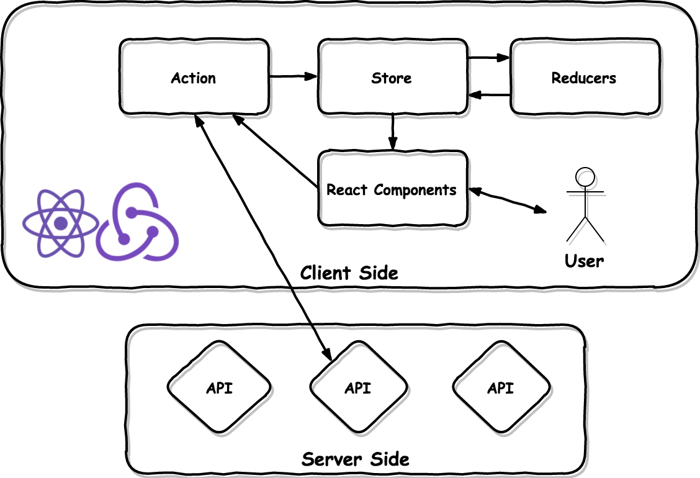

# lecture-w8-react

## Run

- run server

```cmd
cd [lecture-w6-spring-mvc]
mvn clean compile -DskipTests
mvn spring-boot:run
```

- run client

```cmd
cd [lecture-w8-react]
npm install
npm start
```

http://localhost:3000/

- build dev environment

```cmd
npm run build-dev
```

- build production environment

```cmd
npm run build
```

http://localhost:8080/sample

## React Introduction

- React 為 Facebook 所開發的一種 Javascript library，主要用來改善以往大型應用程式透過
不斷的操作 DOM 物件而寫出了非常複雜難以維護的程式碼。React 透過 Component 的搭
配組合，有效減少 script 的重複，並且將複雜的 DOM 物件操作交由 React 的 library，程
式開發者只須專注於資料結構與頁面的設計，不用再關心 DOM 的操作。
- 更多介紹請參照 [React](https://facebook.github.io/react/tutorial/tutorial.html)

## Life Cycle

- **寫 React 前最重要的是要認識整個 Component 的生命週期**

```javascript
import PropTypes from 'prop-types';
import * as React from "react";

export default class MyComponent extends React.Component {
  
  constructor(props) {
    super(props);
    // Component render 前觸發，整個 Component 的生命週期中只會觸發一次
    // 如果需要在 constructor 中使用 this.props 則執行 super(props)，否則執行 super()
    this.state = {}; // 設定整個 Component 初始狀態，只能在 constructor 中使用，之後要更新 state 一律使用 this.setState({})
  }
  
  componentDidMount() {
    // Component render 完成後觸發，整個 Component 的生命週期中只會觸發一次
  }
  
  componentWillReceiveProps(nextProps) {
    // Component 收到 properties 時觸發，會在 render 前就執行
  }
  
  componentDidUpdate() {
    // Component render 完成後觸發，首次安裝 Component 時不會觸發，之後的重新 render 才會觸發
  }
  
  shouldComponentUpdate(nextProps, nextState) {
    // Component 是否需要被重新 render，須 return true or false
  }
  
  render() {
    // 在這邊 return 要 render 的 html tag 或其他 Component
    return (
      <span />
    )
  }
}

// 定義 Component 要傳入的參數，應提供註解說明每個參數
MyComponent.propTypes = {
    page: PropTypes.object,
    onPageClick: PropTypes.func.isRequired,
    maxButtons: PropTypes.number
};

// 定義 Component 的 default properties，props 才是在此定義，state 在 constructor 中用 this.state = {} 定義
MyComponent.defaultProps = {
  maxButtons: 5
};
```

- 假設現在有一個 Component 首次被執行後會在 componentDidMount 去 Server 端要資料並更新當前這個 Component，
那整個生命週期會是 `constructor() -> render() -> componentDidMount() -> componentWillReceiveProps() ->
shouldComponentUpdate() -> render() -> componentDidUpdate()`

- 如果該 Component 一直存在頁面上，那第二次以後取得資料時他的生命週期會是 `componentWillReceiveProps() ->
shouldComponentUpdate() -> render() -> componentDidUpdate()`

- 如果在 shouldComponentUpdate() 回傳了 false，則 `render() -> componentDidUpdate()` 這段將不會被執行

- `this.setState({})` 用於更新 Component 的狀態資料，一但執行了 Component 就會被重新 render

- 如果要在 componentDidUpdate() 中執行 this.setState({}) 則務必增加 shouldComponentUpdate() 的判斷，
否則將造成無窮迴圈

## this.setState 是非同步的

```javascript
handleChange = (e) => {
  this.setState({value: e.target.value});
  console.log(this.state.value);
}
```

- 以上程式碼並不保證可以取到更新後的 value，這是因為 React 的 setState 本身是個非常複雜的計算過程，
會經過 React 自身的 diff 演算法，最終得出需要重新 render 的元件，並且為了避免使用者在極短時間內下達
了多次 setState 而造成過度渲染的問題，所以 setState 被設計為延時執行，目的是為了將短時間內的多個
setState 進行合併

- 如果一定要在 state 確認更新後取到值，可以在 setState 傳入第 2 個 callback function 參數
```javascript
this.setState({value: e.target.value}, () => { console.log(this.state.value) })
```

## Control value & Uncontrol value

- Control value 指的是 input 的 value 被綁定於一個 state 物件，也就是這個 input 是 stateful，任何的 state
更動都將連帶變動 input 的 value，此時 input 顯示的值只有透過 setState 時才會變動，如果沒有下 setState 則
不管在頁面輸入任何值都將不會更動 input，此 input 受控於 Component 的 state，而不是自身的 DOM
```javascript
<input type="text" className="form-control" name="account" placeholder="Account"
  value={this.state.account} onChange={this.handleChange}/>
```

- Uncontrol value 指的是 input 的 value 不綁定於任何物件，也就是這個 input 是 stateless，任何的 state
更動都不會變動 input 的 value，此 input 受控於自身的 DOM
```javascript
<input type="text" className="form-control" name="account" placeholder="Account"
  defaultValue={this.account} onChange={this.handleChange}/>
```

## Redux Introduction



- Redux 改良自 Facebook 提出的 Flux 架構，與 Flux 相同採用單向資料流，並將複雜的資料邏輯處理交給
Reducer，讓 Component 儘量只專注於頁面設計而非資料處理
- 更詳細的介紹請參照 [Redux](http://chentsulin.github.io/redux/index.html)

## Action Creator

- Action Creator 用來提供 Api 給 Component 使用，可分為同步與非同步 2 種

```javascript
// 同步 action， return 一個 Object，type 為必要參數，由 redux 幫你進行 dispatch 事件
export const showAlert = (alertOptions, messages) => {
  return {
    type: CommonEvents.SHOW_ALERT,
    alertOptions,
    messages
  }
};

// 非同步的 actoin，return 為 Promise，redux 會提供 dispatch 讓你決定何時要發佈事件，type 為必要參數
export const add = (type, url, params) => {
  return function (dispatch) {
    return fetch(url, {
      method: 'POST',
      headers: {
        'Accept': 'application/json',
        'Content-Type': 'application/json; charset=utf-8'
      },
      body: JSON.stringify(params)
    })
      .then(response => response.json())
      .then(data => dispatch({type, data}))
  }
};
```

## Reducer

- Reducer 會註冊關心的事件，在處理完 Action 帶過來的資料後回傳 state，
如果不是自己關心的事件則回傳原本的 state，若要變更 state 內的資料則務必回傳新的
state 而不是去修改原本的 state
- Reducer 本身要是一個 pure function
    - 參數必須是 immutable，不可以對 input 參數直接進行修改
    - 傳入的參數若是沒有改變，則不論任何時間調用都要回傳相同值
    - 不應該去使用第三方的 API 取資料或者使用 Math.random、new Date() 這些不確定回傳值的 function

```javascript
import {CommonEvents} from "../constants/Events";

const message = (state = {count: 0, show: false, alertOptions: {}, messages: []}, action) => {
  switch (action.type) {
    case CommonEvents.UPDATE_MESSAGE_COUNT: // 註冊關心的事件
      return Object.assign({}, state, {count: action.count}); // 若要變更 state 內的資料則務必回傳新的 state
    case CommonEvents.TOGGLE_MESSAGE:
      return Object.assign({}, state, {show: action.show});
    case CommonEvents.SHOW_ALERT:
      return Object.assign({}, state, {alertOptions: action.alertOptions, messages: action.messages});
    default: // 不是自己關心的事件則回傳原本的 state
      return state;
  }
};

export default message;
```

## React-Redux Component

- Component 只會取自己需要的 state 回來處理，這裡的 state 指的是 Redux 的 state，不是 React 的 state，
Redux 的 state 又稱做 global state，而 React 的 state 則稱做 local state，一般處理做法是從 global state
取回部份資料，存到 local state，若只是自身的 Component 在做資料異動可以直接使用 local state 處理即可，
但若是無關聯的 Component 要做資料傳遞或者要從 Server 端拉資料，都應該透過 Redux dispatch action 的方式來處理
```javascript
import {connect} from "react-redux";

class Message extends React.Component {
  
  constructor() {
    super();
  }
  
  render() {
    return (
      <span />
    )
  }
}

/* 實做一個 funciton，Redux 會把整個應用程式的 state 當作參數傳給這個 funciton
 * 可以從這個 state 取出自己的 Component 需要處理的資料，當資料有異動時這個
 * Component 就會收到新的 props，接下來的生命週期會是
 * componentWillReceiveProps() -> shouldComponentUpdate() -> render() -> componentDidUpdate()
 */
const mapStateToProps = (state) => {
  return {
    messageCount: state.message.count,
    showMessage: state.message.show,
    alertOptions: state.message.alertOptions,
    messages: state.message.messages
  }
};

// 使用 Redux 提供的 connect function 將 Redux state bind 到 React props
export default connect(mapStateToProps)(Message);
```

## Dispatch Aciton Creator
- 當我們需要 dispatch 一個 action 時，可以透過 Redux bind 到 Component 上的 this.props.dispatch
```javascript
import {connect} from 'react-redux';
import {getOne} from '../../actions/actions';

class UserEdit extends React.Component {
  
  constructor() {
    super();
  }
  
  componentDidMount() {
    // 透過 dispatch 取得使用者資料
    if (!!this.props.match.params.id) {
      this.props.dispatch(getOne(UserEvents.GET_USER, WebUtils.url(UserUris.REST_USERS), this.props.match.params.id));
    }
  }
  
  render() {
    return (
      <span />
    )
  }
}

const mapStateToProps = (state) => {
  return {
    user: state.user.entityUpdated,
    redirect: state.user.redirect,
    message: state.user.message,
  }
};

export default connect(mapStateToProps)(UserEdit);
```